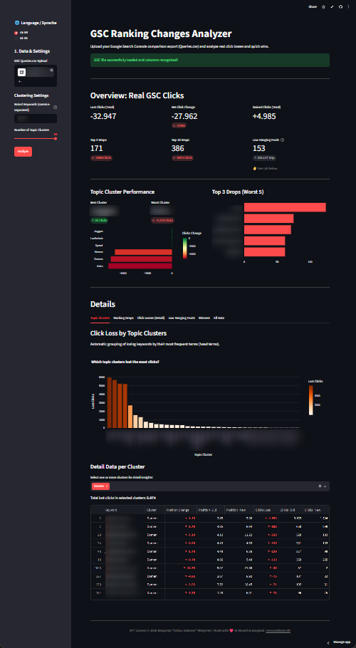

# 📉 GSC Ranking Changes Analyzer

Ein leistungsstarkes, lokales SEO-Dashboard zur blitzschnellen Analyse von Ranking- und Traffic-Veränderungen aus der Google Search Console. Entwickelt für SEOs, um aus dem rohen "Zeitraum-Vergleichs-Export" der GSC sofortige Handlungsempfehlungen, Themen-Cluster und präzise Absturz-Analysen abzuleiten.

[](https://gsc-ranking-changes-analyzer.streamlit.app/)
[](LICENSE)
[](https://www.python.org/)
[](https://streamlit.io/)

> 🌍 *Read this in [English](README.md).*

**👉 Direkt ausprobieren — ohne Installation: [gsc-ranking-changes-analyzer.streamlit.app](https://gsc-ranking-changes-analyzer.streamlit.app/)**



---

## 🌟 Kern-Features

*   **🌐 100% Sprach- & Format-Unabhängig (Positional Parsing):** Es ist völlig egal, ob deine GSC auf Deutsch ("Häufigste Suchanfragen") oder Englisch ("Top queries") steht oder ob Dezimalzahlen mit Komma oder Punkt exportiert wurden. Das Skript erkennt Encoding und Trennzeichen automatisch und liest die Daten stur anhand ihrer GSC-Standardposition aus.
*   **🇬🇧🇩🇪 Zweisprachiges UI:** Das gesamte Dashboard lässt sich mit einem Klick in der Sidebar zwischen Deutsch und Englisch umschalten.
*   **🧩 Lokales, abhängigkeitsarmes Keyword-Clustering:** Clustert tausende Keywords in Millisekunden in Themenbereiche (Head-Terms) per Frequenz-Analyse (Wortzählung minus Stopwords) – **kein KI-Modell, keine API, keine Kosten**, komplett lokal. Inklusive Heatmap für die besten und schlechtesten Cluster.
*   **🎯 Intelligente Change-Metriken:** Berechnet nicht nur simple Differenzen, sondern taggt Keywords automatisch nach harten Ranking-Grenzen (`New`, `OoTop3`, `OoTop10`, `OoSERP2`, `OoTop100`, `IntoTop10`). Mikro-Schwankungen (< 1.0) werden sauber als `None` getrennt, alle anderen als `Changed`.
*   **🍎 Low Hanging Fruits:** Identifiziert "Schwellen-Keywords", die auf Seite 2 ranken (Position 11–15), aber bereits echte Impressionen generieren – die schnellsten Quick-Wins im SEO.
*   **📊 Interaktives Dashboard:** Eine massive KPI-Matrix direkt nach dem Upload zeigt Total-Verluste, Netto-Veränderungen, Top 3 & Top 10 Abstürze sowie die Performance deiner Themen-Cluster auf einen Blick.

---

## 📑 Aufbau der Analyse (Die 6 Tabs)

Sobald du deine `Queries.csv` hochgeladen hast, generiert die App 6 interaktive Analyse-Reiter:

1.  **Themen-Cluster:** Bündelt die Keyword-Verluste nach Begriffen. Erkennt sofort, ob ein bestimmtes Themenfeld (z.B. "Winterreifen" oder "Kreditkarte") kollektiv abgestürzt ist. Du kannst gezielt Brand-Keywords herausfiltern.
2.  **Ranking Drops:** Sortiert die Abstürze in priorisierte Kategorien:
    *   **Top 3 Drops:** Der absolute Schmerz (von Platz 1–3 auf 4+ gefallen).
    *   **Top 10 Drops:** Aus der Seite 1 gerutscht.
    *   **Seite 2 Drops:** Von Seite 2 weiter nach hinten.
    *   **Komplette Verluste:** Aus den Top 100 gefallen.
3.  **Klick-Verluste (Detail):** Die reine, harte Liste aller Keywords, die an Traffic verloren haben, absteigend sortiert nach dem Schmerz-Faktor (Clicks Loss).
4.  **Low Hanging Fruits:** Schwellen-Keywords auf Position 11–15, sortiert nach aktuellen Impressionen. Mit ein paar internen Links oder leichten Content-Ergänzungen holst du dir hier den Traffic.
5.  **Gewinner:** Wer SEO macht, will auch Erfolge sehen. Zeigt dir, welche Keywords massiv an Klicks gewonnen haben (inklusive Bubble-Chart zur Visualisierung).
6.  **Alle Daten:** Der ultimative Daten-Dump mit allen neu errechneten KPIs (wie "Total Ranking-Veränderung", "Clicks Change" als kombinierte Gain/Loss-Metrik) und interaktiven **Filtern** (Cluster, Change-Type, Keyword-Suche). Ideal für tiefgehende Analysen.

---

## ⚙️ So bekommst du die Daten aus der GSC

Das Tool benötigt exakt **eine** Datei:
1. Öffne die **Google Search Console** deiner Domain.
2. Gehe auf **Leistung → Suchergebnisse**.
3. Klicke oben auf den **Datumsfilter** und wähle den Reiter **Vergleichen** (z.B. "Letzte 28 Tage mit vorherigem Zeitraum vergleichen").
4. Klicke auf **Anwenden**.
5. Klicke oben rechts auf **Exportieren** und wähle **CSV herunterladen**.
6. Entpacke die ZIP-Datei. Du findest darin eine Datei namens `Queries.csv`.
7. Lade exakt diese `Queries.csv` in die App hoch.

---

## 🚀 Installation & Lokaler Start

Dieses Tool nutzt `streamlit` für das UI, `pandas` für die Datenverarbeitung und `plotly` für die Grafiken. Wir empfehlen den blitzschnellen Python-Manager [`uv`](https://github.com/astral-sh/uv):

```bash
uv run --python 3.12 --with-requirements requirements.txt streamlit run app.py
```

Mit `uv` brauchst du keine manuellen virtuellen Umgebungen – es installiert die Requirements on the fly und startet den Server isoliert. Das Terminal gibt dir eine lokale URL (meist `http://localhost:8501`). Öffne diese im Browser.

---

## ☁️ Deployment auf der Streamlit Community Cloud

Das Projekt ist "Cloud Ready" und kann in wenigen Klicks kostenlos gehostet werden:
1. Pushe diesen Ordner (`app.py` und `requirements.txt`) in ein GitHub-Repository.
2. Melde dich auf [share.streamlit.io](https://share.streamlit.io) mit deinem GitHub-Account an.
3. Klicke auf **New app**, wähle das Repo und setze `app.py` als Main File.
4. Klicke auf **Deploy**. Fertig!

---

## 🔒 Datenschutz

Die gesamte Verarbeitung läuft lokal (oder in deiner eigenen Streamlit-Instanz). Deine `Queries.csv` wird an keine fremde API geschickt – die Analyse macht keinerlei externe Calls.

---

## 📝 Lizenz & Credits

MIT License © 2026 Benjamin "SEOux Indianer" Wingerter
Made with ❤️ in Munich & Bangkok: [seouxindianer.de](https://seouxindianer.de)
